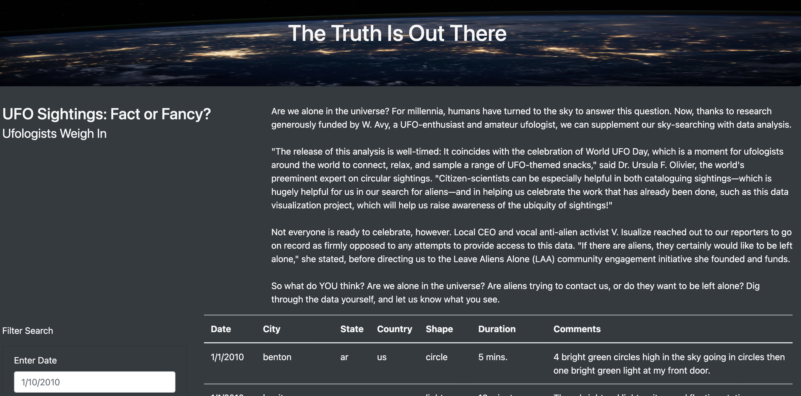
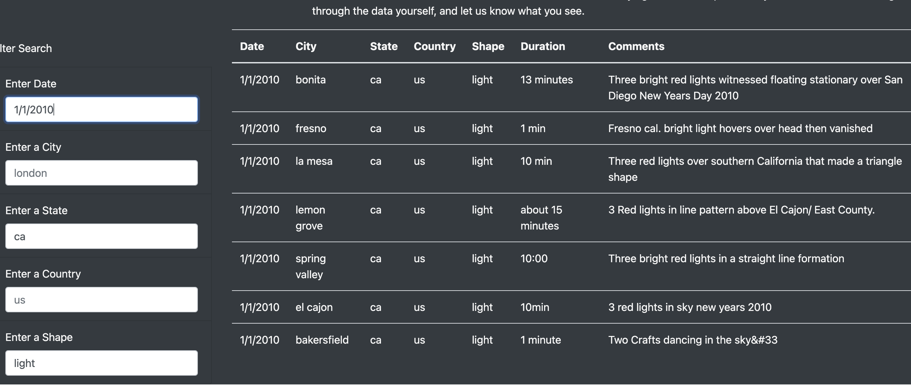
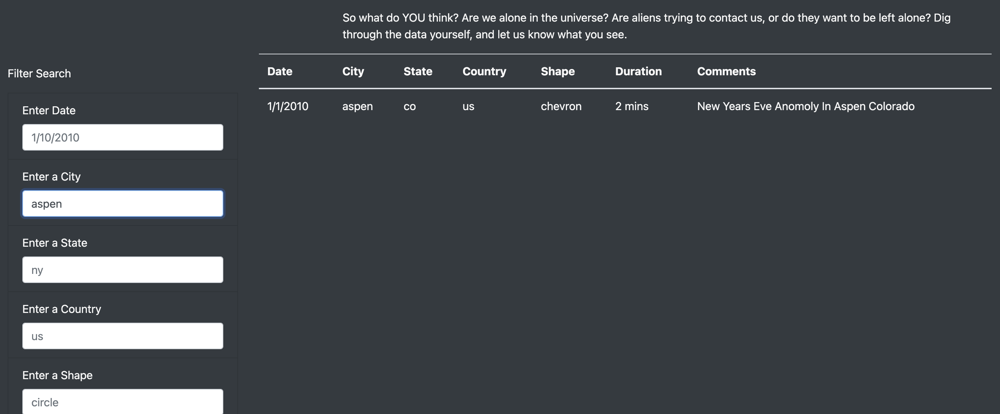
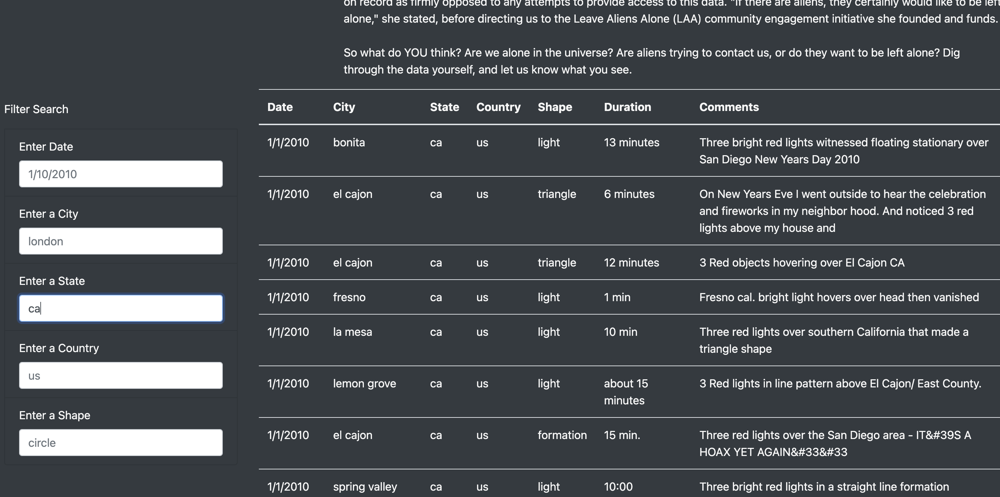
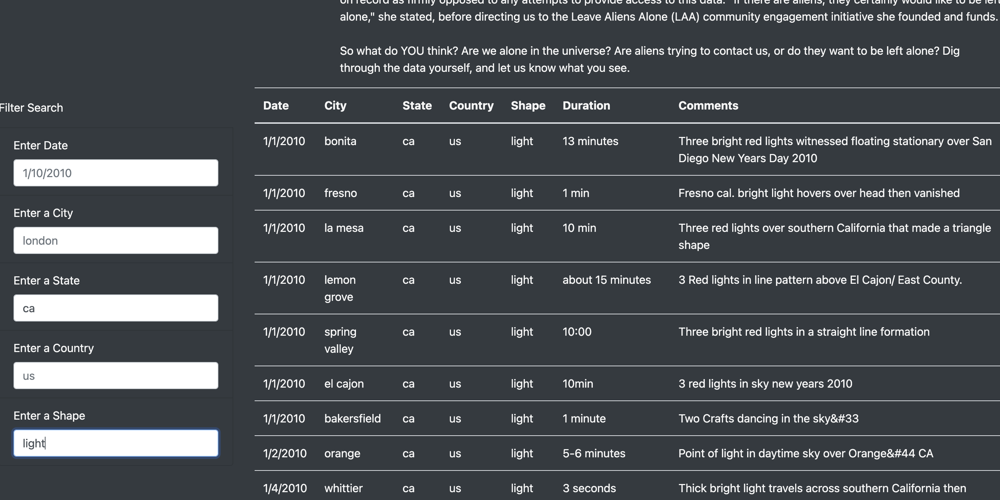

# UFOs

## Project Overview

This project focuses on building a dynamic webpage that accepts user inputs and adjusts accordingly to display information about UFO sightings.
In order to perform their analysis, users will be able to filter the UFO sightings table based on multiple criteria such as the event date, city, state, country and shape.

## Resources:
Data Source: UFO data
Software: HTML/CSS, JavaScript, Visual Studio Code 1.49.1, BootStrap 4.0.0 

## Results

On  new webpage you can use the search criteria. The user enters the criteria such as date, city, state, country or shape, the change will be detected and the table will be updated.

UFO Sightings webpage

Filtering by  date

Filtering by city

Filtering by state

Filtering shape

## Summary 

- The drawback of this design is the difficulty for the user to know exact parameter to use for the filtering. For example we don't know what dates are available for search. 

- The button to clear all filters will be helpful for new search

- The lists including all available dates/cities/states/countries/ shapes  will be helpful for new serch.
